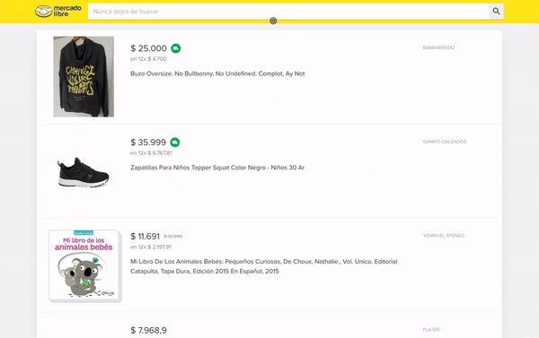

{width=250px}

# Prueba tecnica Mercado Libre


> **Prerrequisitos**
>
>- Esta prueba técnica se realizó en React utilizando el framework Redwoodjs.
>- La arquitectura es de tipo monorepo; en este caso, se utiliza únicamente la carpeta web dentro de los recursos del repositorio.
>- Esta prueba no incluye configuraciones especiales ni archivos env.
> - Redwood requiere [Node.js](https://nodejs.org/en/) (>=14.x) y [Yarn](https://yarnpkg.com/) (>=1.15).
> - ¿Estás utilizando Windows? Para obtener mejores resultados, sigue nuestra [guía de configuración para desarrollo en Windows](https://redwoodjs.com/docs/how-to/windows-development-setup).


Instalando las dependencias:

```
yarn install
```

Luego, inicia el servidor de desarrollo:

```
yarn redwood dev web
```

Alternativamente, puedes usar el comando personalizado:

```
yarn start
```

# Demo
Visita la demostración implementada en:
```
url: https://test-mercado-libre-front-end.vercel.app/
```


#### Listado de productos


#### Detalle de producto


#### Responsive


## Dependencias

Para este proyecto, se utilizaron las siguientes librerías:

- **MUI - Material para React:** Utilizado para controlar el tema general y facilitar el uso de componentes y reglas UI.
- **MUI Icons:** Agrega iconos al proyecto.
- **Axios:** Biblioteca para realizar solicitudes HTTP.

## Listado de mejoras

1. Se añadió una versión responsive para las vistas solicitadas.
2. El logo varía según el ancho de la pantalla.
3. Se incluyó un sistema de paginación y un selector de cantidad de resultados.
4. Galería de productos.
5. Tema, logo, estilos y fuentes acordes al brand actual de la marca Mercado Libre.


## Estructura del repositorio
└── web
    ├── public
    │   ├── favicon.png
    │   ├── README.md
    │   └── robots.txt
    └── src
        ├── components
        ├── layouts
        ├── pages
        │   ├── FatalErrorPage
        │   │   └── FatalErrorPage.jsx
        │   └── NotFoundPage
        │       └── NotFoundPage.jsx
        ├── App.jsx
        ├── entry.client.jsx
        ├── index.css
        ├── index.html
        └── Routes.jsx

#### Desarrollador
- [Michael Martinez](https://github.com/mi-martinez) - Desarrollador principal
